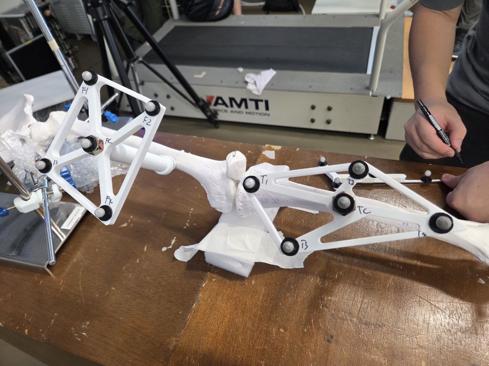
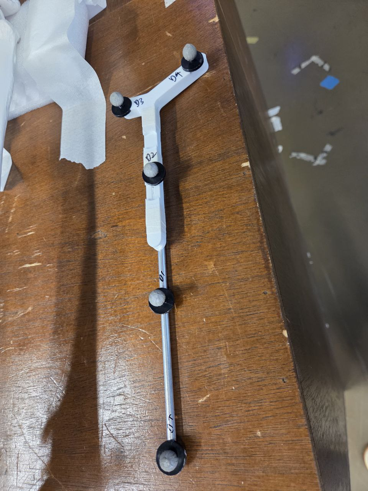
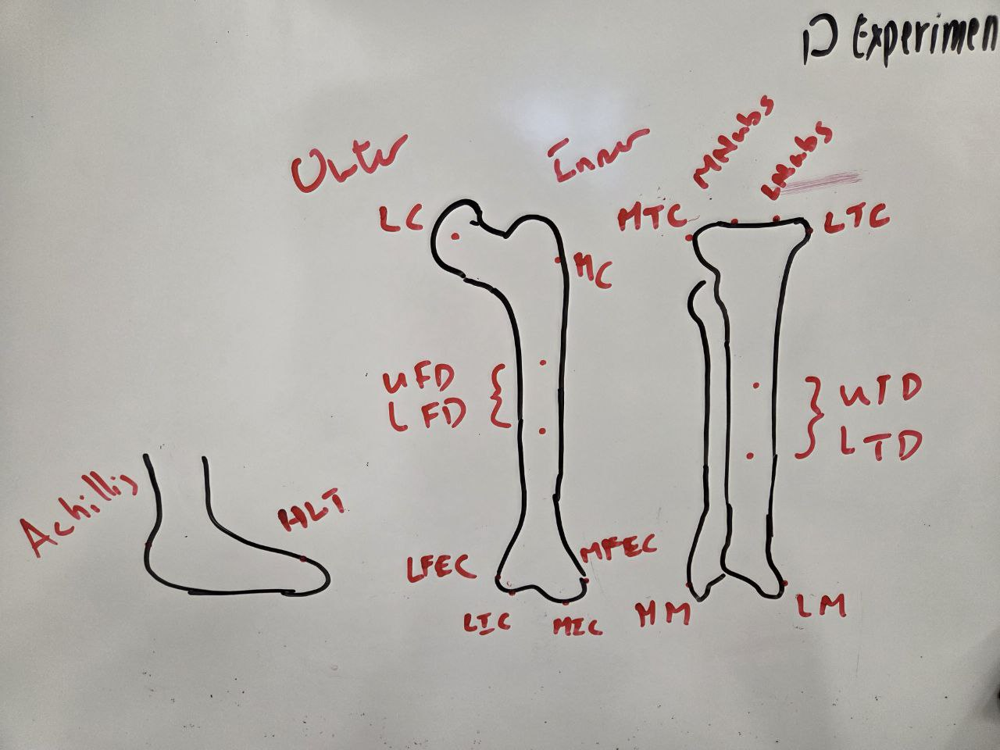

# HTO Mechanical Axis Computation Pipeline

Goal: Computing lower-limb mechanical axis alignment angles used in High Tibial Osteotomy (HTO) surgical planning.

The pipeline takes in Vicon motion capture marker trajectory data captured on a phantom knee model (Synbone model in this case), estimates joint centres via rigid body tracking and sphere-fitting, and outputs five clinically relevant frontal-plane angles. For the full mathematical specification, see [docs/algorithm_specification.md](docs/algorithm_specification.md).

---

## Experiment

### Objective

Derive the mechanical axis alignment of the lower limb from 3D marker trajectory data and compute the standard HTO planning angles (HKA, mLDFA, MPTA, JLCA, mLDTA). The phantom model eliminates soft tissue artefact, providing a rigid-body ground truth for algorithm validation before clinical application.

### Physical Setup

- **Model:** Synbone Model.
- **Motion capture:** Vicon system at 100 Hz, coordinates in millimetres.
- **Force plates:** AMTI (captured but not used in this pipeline).

Three rigid marker clusters, each with five retroreflective markers, are attached to the model and to a digitiser:

| Cluster   | Markers            | Attachment                               | Purpose                                  |
| --------- | ------------------ | ---------------------------------------- | ---------------------------------------- |
| Femoral   | F1, F2, F3, F4, FC | Rigid plate screwed to the femoral shaft | Track femoral segment pose               |
| Tibial    | T1, T2, T3, T4, TC | Rigid plate screwed to the tibial shaft  | Track tibial segment pose                |
| Digitiser | D1, D2, D3, D4, DT | Handheld rigid tool                      | Register anatomical landmarks (DT = tip) |

<p align="center">
  <br/>
  <em>Femoral cluster (F1-F4, FC) on the femoral shaft and tibial cluster (T1-T4, TC) on the tibial shaft, mounted on the Synbone model with AMTI force plate in background.</em>
</p>

<p align="center">
  <br/>
  <em>Handheld digitiser tool with four reference markers (D1-D4) and the digitiser tip (DT) at the bottom, used to register anatomical landmarks.</em>
</p>

### Anatomical Landmarks

Six bony prominences are digitised on the phantom model by placing the digitiser tip (DT) on each point while the relevant cluster is simultaneously visible:

| Abbreviation | Full Name                  | Anatomical Description                                        | Segment |
| ------------ | -------------------------- | ------------------------------------------------------------- | ------- |
| LFEC         | Lateral Femoral Epicondyle | Most prominent point on the lateral femoral epicondyle        | Femur   |
| MFEC         | Medial Femoral Epicondyle  | Most prominent point on the medial femoral epicondyle         | Femur   |
| LTP          | Lateral Tibial Plateau     | Most lateral point on the proximal tibial articular surface   | Tibia   |
| MTP          | Medial Tibial Plateau      | Most medial point on the proximal tibial articular surface    | Tibia   |
| LM           | Lateral Malleolus          | Most prominent point on the lateral malleolus (distal fibula) | Tibia   |
| MM           | Medial Malleolus           | Most prominent point on the medial malleolus (distal tibia)   | Tibia   |

LFEC and MFEC are registered relative to the **femoral** cluster. LTP, MTP, LM, and MM are registered relative to the **tibial** cluster. In the current protocol LFEC is estimated by mirroring MFEC across the knee midline when not directly digitised.

<p align="center">
  <br/>
  <em>Reference diagram showing anatomical landmark locations on the femur and tibia. Key landmarks labelled: LFEC and MFEC (distal femur), MTC/LTC (tibial condyles corresponding to MTP/LTP), MM and LM (malleoli). Cluster marker placement regions (UFD/LFD on the femur, UTD/LTD on the tibia) are also indicated.</em>
</p>

### Trial Protocol

| Trial Type     | Example Files (04-Feb)                                            | What Was Done                                                                                     |
| -------------- | ----------------------------------------------------------------- | ------------------------------------------------------------------------------------------------- |
| Static         | `Static_Trial01.csv`                                              | Model stationary, all clusters visible. Used to build reference local coordinate systems.         |
| Digitiser      | `Digitizer_trial.csv`, `Digitizer_trial 1.csv`                    | Digitiser tip placed sequentially on anatomical landmarks while clusters remain visible.          |
| Rotation (HJC) | `Dynamic Trial.csv`, `Dynamic Trial 1.csv`, `Dynamic Trial 2.csv` | Femur rotated about the hip joint so femoral markers trace arcs on spheres centred at the hip. |
| Left-Right     | `Dynamic Trial_Left_Right_Motion.csv`, `...Motion 1.csv`          | Lateral-medial knee motion for dynamic angle tracking.                                            |
| Up-Down        | `Dynamic Trial_Up_Down_Motion.csv`, `...Motion 1.csv`             | Flexion-extension motion for dynamic angle tracking.                                              |

---

## Clinical Angles

All angles are measured in the **frontal (coronal) plane** of the lower limb.

| Angle | Full Name                               | What It Measures                                                                                          | Normal Value      |
| ----- | --------------------------------------- | --------------------------------------------------------------------------------------------------------- | ----------------- |
| HKA   | Hip-Knee-Ankle                          | Overall lower-limb alignment at the knee between the femoral and tibial mechanical axes                   | 180 deg (neutral) |
| mLDFA | Mechanical Lateral Distal Femoral Angle | Orientation of the distal femoral joint line relative to the femoral mechanical axis                      | 85-90 deg         |
| MPTA  | Medial Proximal Tibial Angle            | Orientation of the proximal tibial joint line relative to the tibial mechanical axis (primary HTO target) | 85-90 deg         |
| JLCA  | Joint Line Convergence Angle            | Angular convergence between the distal femoral and proximal tibial joint lines                            | 0-2 deg           |
| mLDTA | Mechanical Lateral Distal Tibial Angle  | Orientation of the distal tibial joint line (ankle) relative to the tibial mechanical axis                | ~89 deg           |

The **mLPFA** (Mechanical Lateral Proximal Femoral Angle) is not computable with the current marker set because the greater trochanter is not digitised.

**Algebraic consistency check:** The computed angles satisfy the identity

```
HKA_deviation = mLDFA - MPTA + JLCA
```

where `HKA_deviation = 180 - HKA`. This relationship (Paley, 2002) serves as an internal validation of measurement consistency.

---

## Pipeline Overview

The processing workflow consists of seven steps, implemented in `src/pipeline.py`:

1. **Load trial data** : Parse all Vicon CSV files (static, digitiser, rotation, dynamic) using the dual-structure format (force plate section + trajectory section).
2. **Build reference LCS**: Construct a local coordinate system for each marker cluster from the static trial via Singular Value Decomposition (SVD) of the mean-centred marker positions.
3. **Detect marker swaps** : Check for and correct marker label inconsistencies between trials by comparing inter-marker distance patterns against the static reference.
4. **Register anatomical landmarks**: Auto-segment the digitiser tip (DT) trajectory to detect stationary contact periods, extract landmark positions, and express them in cluster-local coordinates.
5. **Estimate joint centres**: Compute the Hip Joint Centre (HJC) by fitting spheres to femoral marker trajectories during rotation trials (Levenberg-Marquardt optimisation). Compute the Knee Joint Centre (KJC) as the epicondyle midpoint and the Ankle Joint Centre (AJC) as the malleoli midpoint.
6. **Compute clinical angles**: Define the frontal plane from the femoral mechanical axis and transepicondylar axis, then compute all five HTO angles by projecting relevant vectors onto this plane.
7. **Export results**: Write static angles, landmarks, dynamic angle time-series, and rigidity validation to JSON and CSV files.

An **alternative algebraic pipeline** (`main_algebraic.py`) replaces the nonlinear sphere-fit in step 5 with a linearised least-squares approach that mirrors the Mathematica reference implementation, allowing direct cross-validation.

---

## File Reference

### Entry Points

**`main.py`**: Primary CLI entry point. Parses command-line arguments, invokes the full pipeline, exports results to JSON and CSV, and optionally launches the interactive 3D visualisation. Supports configurable HJC method, digitiser segmentation parameters, and custom landmark mappings.

**`main_algebraic.py`**: Alternative entry point using the algebraic (linearised) sphere-fit for HJC and KJC estimation. Mirrors the Mathematica reference implementation. Outputs `landmarks_2.json` for comparison with the primary pipeline. Does not process dynamic trials or launch visualisation.

### Source Modules (`src/`)

| Module                    | Purpose                                        |
| ------------------------- | ---------------------------------------------- |
| `data_loader.py`          | Load and parse Vicon CSV files                 |
| `rigid_body.py`           | LCS construction and Kabsch pose tracking      |
| `joint_centers.py`        | Joint centre estimation (sphere-fit, midpoint) |
| `angles.py`               | Frontal-plane HTO angle computation            |
| `digitizer.py`            | Anatomical landmark registration               |
| `algebraic_sphere_fit.py` | Linearised sphere-fit (Mathematica reference)  |
| `pipeline.py`             | End-to-end pipeline orchestration              |
| `utils.py`                | Shared mathematical utilities                  |

**`data_loader.py`** -- Loads Vicon-exported CSV files that use a dual-structure format: force plate data above a "Trajectories" keyword, marker trajectories below. Provides the `TrialData` dataclass and `load_all_trials()` which maps descriptive trial names (e.g. `static`, `digitizer_1`, `rotation_1`) to file paths. Defines marker group constants (`FEMORAL_MARKERS`, `TIBIAL_MARKERS`, `DIGITIZER_MARKERS`).

**`rigid_body.py`**: Implements LCS construction from a static trial via SVD (`build_reference()`) and the Kabsch algorithm for frame-by-frame rigid body pose tracking (`kabsch_align()`, `track_dynamic_trial()`). Provides global coordinate transforms for landmarks (`transform_point_to_global()`), rigidity validation via inter-marker distance monitoring (`validate_rigidity()`), and marker label swap detection and correction (`detect_marker_swap()`). Key dataclasses: `RigidBodyReference` and `FramePose`.

**`joint_centers.py`**: Estimates the HJC via nonlinear least-squares sphere fitting (Levenberg-Marquardt via `scipy.optimize.least_squares`). Supports two methods: `pooled` (single sphere fitted to all markers) and `per_marker` (consensus of independently fitted per-marker spheres). Computes KJC as the midpoint of the femoral epicondyles and AJC as the midpoint of the malleoli. Key dataclass: `HJCResult`.

**`angles.py`**: Computes the five HTO clinical angles in the frontal plane. Constructs the frontal plane normal from the femoral mechanical axis cross the transepicondylar axis. Each angle function projects the relevant vectors onto this plane and computes the inter-vector angle. Conventions follow Paley's deformity analysis framework. Key dataclass: `HTOAngles`.

**`digitizer.py`**: Handles anatomical landmark registration from digitiser trials. Implements auto-segmentation of the digitiser tip trajectory by detecting stationary contact periods where velocity drops below a configurable threshold. Strips rest-position segments from the start and end of trials. Assigns detected segments to landmark names in the order specified by the user. Also provides `express_landmark_in_lcs()` for converting global landmark positions to cluster-local coordinates.

**`algebraic_sphere_fit.py`**: Implements the linearised least-squares sphere-fitting approach from the Mathematica reference notebook. Solves a linear system for a shared centre with per-marker radii. Used by `main_algebraic.py` as a cross-validation alternative to the nonlinear sphere-fit in `joint_centers.py`.

**`pipeline.py`**: End-to-end orchestrator that coordinates all seven processing steps. Handles LFEC estimation (mirroring MFEC across the knee midline) when it is not directly digitised. Processes all dynamic trials with frame-by-frame Kabsch tracking and angle computation. Provides `extract_angle_time_series()` for converting per-frame angle data to time-indexed arrays. Key dataclasses: `PipelineResults` and `DynamicTrialResult`.

**`utils.py`**: Shared mathematical helper functions: vector normalisation (`normalize`), angle between vectors (`angle_between_vectors`), signed angle in a plane (`signed_angle_in_plane`), vector and point projection onto a plane (`project_onto_plane`, `project_point_onto_plane`), point-to-line distance (`point_to_line_distance`), right-handedness enforcement (`ensure_right_handed`), centroid computation, RMS error, and inter-marker distance calculation.

### Visualisation

**`visualization/dash_app.py`**: Interactive 3D web application built with Plotly Dash. Displays marker clusters, anatomical landmarks, joint centres, mechanical axes, joint lines, and LCS axes in a 3D scatter plot. Features include a trial selection dropdown, frame slider with play/pause animation, visibility toggles for each layer, real-time angle readout panel, and HKA time-series chart. Launch via `--visualize` flag in `main.py`.

### Reference Implementation

**`Original JL ClusterMarker Compute/CAP02.ipynb`**: Reference Python/Jupyter notebook implementing the original joint centre computation using SVD-based coordinate frame construction and algebraic sphere-fitting. Used to validate the Python pipeline against prior work.

**`Original JL ClusterMarker Compute/CAP02_update.nb`**: Mathematica notebook containing the algebraic sphere-fit approach. The `main_algebraic.py` pipeline mirrors this approach and compares results directly.

**`Original JL ClusterMarker Compute/JunLiang CAP02_Gait markers.txt`**: Raw Vicon trajectory data (SHIN1-3, THIGH1-3 markers) from a reference dataset used in the original Mathematica implementation. Provides ground truth for cross-validation.

### Data

**`data/04-Feb-Trials/`**: Primary dataset from the 4 February motion capture session. Contains 11 CSV files: one static trial, three digitiser trials (two used by the pipeline), three rotation trials, two left-right dynamic trials, and two up-down dynamic trials.

**`data/21-Nov-Trials/`**: Earlier dataset from the 21 November motion capture session. Contains 15 CSV files with a different marker naming convention. Includes static trials with integrated digitiser passes, rotation trials, bending/varus motion trials, and Centre of Rotation (COR) trials.

### Outputs

| Output File                | Format | Description                                                                                                    |
| -------------------------- | ------ | -------------------------------------------------------------------------------------------------------------- |
| `static_angles.json`       | JSON   | Static-trial HTO angles (HKA, mLDFA, MPTA, JLCA, mLDTA) and knee offset in mm                                  |
| `landmarks.json`           | JSON   | Anatomical landmark positions and joint centres (HJC, KJC, AJC) in global coordinates                          |
| `landmarks_2.json`         | JSON   | Algebraic pipeline output: landmarks, angles, and per-marker sphere-fit radii for comparison                   |
| `angles_<trial>.csv`       | CSV    | Per-frame time-series of all five angles for each dynamic trial (columns: time, hka, mldfa, mpta, jlca, mldta) |
| `rigidity_validation.json` | JSON   | Per-trial per-cluster rigidity check: mean RMS deviation, max deviation, pass/fail status                      |

### Documentation

**`docs/algorithm_specification.md`**: Complete mathematical and algorithmic specification of the pipeline (880 lines). Covers LCS construction via SVD, the Kabsch algorithm, HJC sphere-fitting, KJC and AJC midpoint definitions, frontal plane construction, all five angle definitions with formulae, error analysis framework (rigidity checks, sphere-fit residuals, Monte Carlo sensitivity), and evaluation methodology. Includes seven peer-reviewed references.

---

## Usage

### Installation

```
pip install -r requirements.txt
```

Dependencies: `pandas >= 2.0`, `numpy >= 1.24`, `scipy >= 1.10`, `plotly >= 5.15`, `dash >= 2.14`.

### Primary Pipeline

```
python main.py --data-dir data/04-Feb-Trials/
```

| Flag                     | Default      | Description                                                       |
| ------------------------ | ------------ | ----------------------------------------------------------------- |
| `--data-dir`             | (required)   | Path to directory containing trial CSV files                      |
| `--output-dir`           | `outputs/`   | Directory for output files                                        |
| `--landmark-config`      | built-in     | Path to JSON file mapping digitiser trial names to landmark names |
| `--hjc-method`           | `per_marker` | HJC estimation method: `pooled` or `per_marker`                   |
| `--velocity-threshold`   | `15.0`       | Digitiser velocity threshold in mm/s for contact detection        |
| `--min-contact-duration` | `0.5`        | Minimum digitiser contact duration in seconds                     |
| `--visualize`            | off          | Launch 3D Dash visualisation after pipeline completes             |
| `--port`                 | `8050`       | Port for the Dash visualisation server                            |

Examples:

```
python main.py --data-dir data/04-Feb-Trials/ --visualize
python main.py --data-dir data/04-Feb-Trials/ --output-dir outputs/ --hjc-method pooled
```

### Algebraic Pipeline

```
python main_algebraic.py --data-dir data/04-Feb-Trials/
```

Produces `outputs/landmarks_2.json` with algebraic sphere-fit joint centres, angles, and per-marker radii for comparison with the primary pipeline and the Mathematica reference.

---

## Validation

The pipeline includes several validation mechanisms:

- **Rigidity check:** Inter-marker distances within each cluster are monitored across all frames. Mean RMS deviation should be < 0.5 mm; individual pair deviations > 1.0 mm are flagged. Results are exported to `rigidity_validation.json`.
- **Kabsch RMSE:** The per-frame fitting error quantifies tracking quality. Values < 0.3 mm indicate excellent tracking; > 1.0 mm indicates marker dropout or mislabelling.
- **Sphere-fit residuals:** The standard deviation of HJC sphere-fit residuals should be < 2 mm. Per-marker centre spread should be < 5 mm.
- **Algebraic cross-validation:** The algebraic pipeline (`main_algebraic.py`) provides an independent estimate of joint centres that can be compared against the primary pipeline and the Mathematica reference implementation.
- **Angle consistency:** The algebraic identity `HKA_deviation = mLDFA - MPTA + JLCA` is checked as an internal consistency gate.

---

## Project Structure

```
nnk-computation/
  main.py                              # Primary CLI pipeline
  main_algebraic.py                    # Algebraic sphere-fit pipeline
  requirements.txt                     # Python dependencies
  src/
    data_loader.py                     # Vicon CSV loading and parsing
    rigid_body.py                      # LCS construction, Kabsch tracking
    joint_centers.py                   # HJC sphere-fit, KJC/AJC midpoints
    angles.py                          # Frontal-plane angle computation
    digitizer.py                       # Landmark registration from digitiser
    algebraic_sphere_fit.py            # Linearised sphere-fit alternative
    pipeline.py                        # End-to-end orchestration
    utils.py                           # Shared math utilities
  visualization/
    dash_app.py                        # Interactive 3D Plotly Dash app
  data/
    04-Feb-Trials/                     # Primary dataset (11 CSVs)
    21-Nov-Trials/                     # Earlier dataset (15 CSVs)
  outputs/                             # Pipeline output files
  docs/
    algorithm_specification.md         # Full mathematical specification
  Original JL ClusterMarker Compute/
    CAP02.ipynb                        # Reference Python notebook
    CAP02_update.nb                    # Reference Mathematica notebook
    JunLiang CAP02_Gait markers.txt    # Reference marker data
```

---

## References

1. Paley D. _Principles of Deformity Correction._ Springer-Verlag, 2002.
2. Grood ES, Suntay WJ. A joint coordinate system for the clinical description of three-dimensional motions. _J Biomech Eng._ 1983;105(2):136-144.
3. Soderkvist I, Wedin PA. Determining the movements of the skeleton using well-configured markers. _J Biomech._ 1993;26(12):1473-1477.
4. Gamage SSHU, Lasenby J. New least squares solutions for estimating the average centre of rotation and the axis of rotation. _J Biomech._ 2002;35(1):87-93.
5. Kabsch W. A solution for the best rotation to relate two sets of vectors. _Acta Cryst A._ 1976;32(5):922-923.
6. Ehrig RM, Taylor WR, Duda GN, Heller MO. A survey of formal methods for determining the centre of rotation of ball joints. _J Biomech._ 2006;39(15):2798-2809.
7. Miniaci A, Ballmer FT, Ballmer PM, Jakob RP. Proximal tibial osteotomy: a new fixation device. _Clin Orthop Relat Res._ 1989;(246):250-259.
